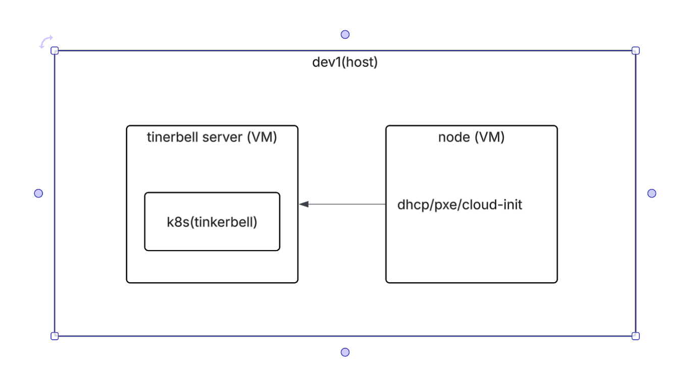
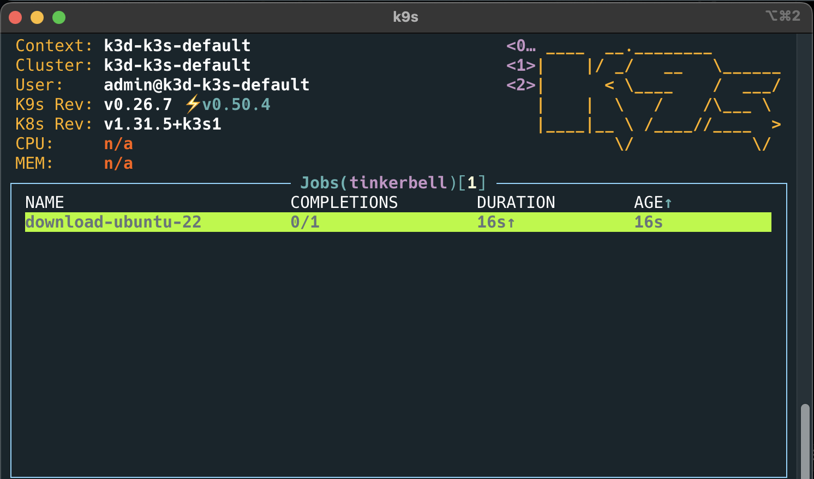

# 1. basic install

## architecture



## let's create create tinkerbell server (vm)

```sh
cd /tmp

touch meta-data
vi user-data

#cloud-config
ssh_pwauth: true # sshd service will be configured to accept password authentication method
disable_root: 0 #enable root login
users:
  - name: root
    plain_text_passwd: ragon
    lock_passwd: false
runcmd:
  - date >> /tmp/birth_certificate
  - reboot

wget https://repo.almalinux.org/almalinux/8/cloud/x86_64/images/AlmaLinux-8-GenericCloud-8.10-20240819.x86_64.qcow2

name=tinkerbell

cp /tmp/AlmaLinux-8-GenericCloud-8.10-20240819.x86_64.qcow2 /tmp/$name.qcow2

virt-install \
  --import \
  --name $name \
  --memory 4048 \
  --vcpus 8 \
  --disk /tmp/$name.qcow2,format=qcow2,bus=virtio \
  --cloud-init user-data=/tmp/user-data,meta-data=/tmp/meta-data \
  --network bridge=br0,model=virtio \
  --graphics vnc,listen=0.0.0.0 \
  --os-variant rhel8.0 \
  --console pty,target_type=serial \
  --noautoconsole

virsh start tinkerbell
virsh console tinkerbell
```

## 아이피 설정

```sh
virsh console tinkerbell

nmcli con show

NAME         UUID                                  TYPE      DEVICE
System eth0  5fb06bd0-0bb0-7ffb-45f1-d6edd65f3e03  ethernet  eth0

nmcli connection modify "System eth0" connection.id eth0

IPADDR=192.168.254.50
GW=192.168.254.254
nmcli connection modify eth0 ipv4.addresses $IPADDR/24 ipv4.gateway $GW ipv4.method manual ipv4.dns "8.8.8.8 4.2.2.2" connection.autoconnect yes
nmcli connection down eth0 && nmcli connection up eth0

# Internet 접속 확인
PING 4.2.2.2 (4.2.2.2) 56(84) bytes of data.
64 bytes from 4.2.2.2: icmp_seq=1 ttl=56 time=9.72 ms
```

## setup tinkerbell server

### install docker

```sh
hostnamectl set-hostname tinkerbell

dnf install -y wget git zsh

dnf config-manager --add-repo https://download.docker.com/linux/rhel/docker-ce.repo

dnf install -y docker-ce docker-ce-cli containerd.io docker-buildx-plugin docker-compose-plugin

systemctl enable --now docker

docker ps -a
```

### install k3d

k3d is a lightweight wrapper to run k3s in docker. It is a great way to run Kubernetes clusters locally.

```sh
curl -s https://raw.githubusercontent.com/k3d-io/k3d/main/install.sh | bash

k3d --help

k3d cluster list

# K3D_FIX_DNS=false is needed because host network mode won't work without it.
K3D_FIX_DNS=false k3d cluster create --network host --no-lb --k3s-arg "--disable=traefik,servicelb,metrics-server,local-storage"

# `--network host` : host network is used to allow the load balancer to advertise a layer 2 address.
# `--no-lb` : the K3D built in load balancer is disabled so we don't have conflicts with the stack load balancer.
# `--k3s-arg "--disable=traefik,servicelb,metrics-server,local-storage"` : disable the built in K3S load balancer, metrics server, and local storage.

k3d cluster list
> NAME          SERVERS   AGENTS   LOADBALANCER
> k3s-default   1/1       0/0      false

mkdir -p ~/.kube
k3d kubeconfig get k3s-default > ~/.kube/config

cat ~/.kube/config

docker logs -f k3d-k3s-default-server-0
```

## install kubectl

```sh
cd /tmp

curl -LO "https://dl.k8s.io/release/$(curl -L -s https://dl.k8s.io/release/stable.txt)/bin/linux/amd64/kubectl"

install -o root -g root -m 0755 kubectl /usr/local/bin/kubectl
```

## install helm

```sh
cd /tmp
curl -fsSL -o get_helm.sh https://raw.githubusercontent.com/helm/helm/main/scripts/get-helm-3
chmod 700 get_helm.sh
./get_helm.sh

helm version
```

## install k9s

```sh
cd /tmp
wget https://github.com/derailed/k9s/releases/download/v0.26.7/k9s_Linux_x86_64.tar.gz
tar xvf k9s_Linux_x86_64.tar.gz
mv k9s /usr/local/bin/
```

## Install the Tinkerbell stack Helm chart

### 0.6.2

최신버전을 사용하자. 이건 사용하지말자.

```sh
# 0.6.2
# export LOADBALANCER_IP=192.168.254.201
# export LOADBALANCER_INTERFACE=eno1
# export HELM_CHART_VERSION=0.6.2
# export NAMESPACE=tinkerbell

# trusted_proxies=$(kubectl get nodes -o jsonpath='{.items[*].spec.podCIDR}' | tr ' ' ',')

# helm install tink-stack oci://ghcr.io/tinkerbell/charts/stack \
# 	--version $HELM_CHART_VERSION \
# 	--create-namespace \
# 	--namespace $NAMESPACE \
# 	--wait \
# 	--set "smee.trustedProxies={${trusted_proxies}}" \
# 	--set "hegel.trustedProxies={${trusted_proxies}}" \
# 	--set "stack.kubevip.interface=$LOADBALANCER_INTERFACE" \
# 	--set "stack.relay.sourceInterface=$LOADBALANCER_INTERFACE" \
# 	--set "stack.loadBalancerIP=$LOADBALANCER_IP" \
# 	--set "smee.publicIP=$LOADBALANCER_IP"
```

### 0.17

이 버전이 최신 버전이며 모든것이 하나의 pod에 모여있다. 관리가 편하다.

<https://github.com/tinkerbell/tinkerbell/releases/tag/v0.17.0>

Hegel has been renamed to Tootles.

```sh
SERVERIP=192.168.254.50 # 여기 수정 서버아이피
trusted_proxies=$(kubectl get nodes -o jsonpath='{.items[*].spec.podCIDR}' | tr ' ' ',')
export HELM_CHART_VERSION=v0.17
export LB_IP=192.168.254.250  # 여기 수정, 아무 아이피나
export ARTIFACTS_FILE_SERVER=http://$SERVERIP:8080 # tinkerbell server ip # 여기 수정
export NAMESPACE=tinkerbell

helm install tinkerbell oci://ghcr.io/tinkerbell/charts/tinkerbell \
  --version "$HELM_CHART_VERSION" \
  --create-namespace \
  --namespace tinkerbell \
  --wait \
  --set "trustedProxies={${trusted_proxies}}" \
  --set "publicIP=$LB_IP" \
  --set "artifactsFileServer=$ARTIFACTS_FILE_SERVER"

kubectl get pods -n $NAMESPACE

kubectl get svc -n $NAMESPACE

mkdir -p /data/git

cd /data/git

git clone https://github.com/teamsmiley/tinkerbell-example.git

cd /data/git/tinkerbell-example/example/1.basic
```

## setup os image nginx

```sh

kubectl -n $NAMESPACE apply -f os-image

kubectl -n $NAMESPACE get svc

# nginx        LoadBalancer   10.43.26.141    192.168.254.251   8080:30249/TCP
```

nginx가 서비스로 올라왓다 그리고 192.168.254.251 아이피를 가지고 있다. 이 아이피는 nginx.yaml에 정의되있다.

cloud image 를 다운받을때가지 기다린다.



wait until all job done

```sh
docker exec -it k3d-k3s-default-server-0 ls -alF /opt/hook/ #download 확인

total 616268
drwxr-xr-x 2 root root        48 Apr 23 21:29 ./
drwxr-xr-x 3 root root        18 Apr 23 21:28 ../
-rw-r--r-- 1 root root 631055738 Apr 23 21:29 jammy-server-cloudimg-amd64.raw.gz
```

ubuntu download 완료

nginx ready to serving os image

조금 더 설명하면 cloud image 는 qcow2포맷이므로 바로 harddisk 에 쓰지 못한다. raw 포맷으로 변경후 적용이 가능하다. download.yaml을 보면 raw를 다시 gz으로 압축하는것을볼수잇다 이렇게 하면 network 사용량을 줄일수있어서다. 우리는 항상 raw.gz을 사용할것이다. 용량이 많이 줄어든다.

```sh
kubectl -n $NAMESPACE get svc
```


nginx svc가 정상적으로 디플로이됫다 다운로드테스트도 해보자.

```sh
cd /tmp

wget http://192.168.254.251:8080/jammy-server-cloudimg-amd64.raw.gz
```

잘된다.

download 테스트 완료

## setup template,hardware,workflow

```sh
kubectl -n $NAMESPACE apply -f .
kubectl -n $NAMESPACE get template,workflow,hardware

NAME                           STATE
template.tinkerbell.org/test

NAME                           TEMPLATE   STATE     ACTION   AGENT
workflow.tinkerbell.org/test   test       PENDING

NAME                           STATE
hardware.tinkerbell.org/test
```

## node provisioning

새로운 vm을 올리면 자동을 pxe가 되면서 부팅되야한다.

```sh
# dev1 호스트에서

virt-install \
  --name test \
  --memory 4048 \
  --vcpus 8 \
  --disk /tmp/test.qcow2,size=100 \
  --graphics vnc,listen=0.0.0.0\
  --network bridge=br0,model=virtio,mac=52:54:00:ff:54:38 \
  --console pty,target_type=serial \
  --pxe \
  --os-variant rhel8.0 \
  --noautoconsole
```


### vm 삭제시

```sh
virsh destroy test
virsh undefine test
rm -rf /tmp/test.qcow2
```

이제 vnc viewer로 접속해서 확인하자.


hookos를 로딩하는것을 볼수 있다. hookos가 기본적으로 로딩되고 이 친구가 나머지것들을 실행해주는것이다.

혹시 vm이 설치가 안되면 hookos에 가서

```sh
ip a

ping 4.2.2.2
ping google.com

```

을 해보기 바란다. hook os가 인터넷이 되야한다.

관련 설정은 hardware.yaml에 저장되 있다.

workflow를 확인해보면 os 설치가 시작된다.


os가 설치된것을 볼수 있다.

## template

서버에 hookos가 실행되고나면 바로 실행할 내용들이다.

현재 template.yaml을 보면 여러가지 action을 실행하는것을 볼수 있다.

핵심적인 내용은

- stream ubuntu image
- grow-partition
- kexec into os

등을 할수가 있다.

https://github.com/tinkerbell/actions 여기에 가면 많은 action을 볼수있다.

간략히 설명하면

- image2disk : raw image를 disk에 저장한다.
- cexec : 명령어를 실행한다. (growpart 등 os가 가지고 잇는모든 명령어를 실행할수가 있다.)
- kexec : 새로 설치한 서버의 커널에 들어갈수 있다. 간단히 이야기하면 재부팅을 하지않고도 바로 부팅을 할수가 있다.
- writefile : 디스크에 파일을 쓸수 있다.

## hardware

hardware.yaml을 보면 disk의 종류나 인터페이스의 설정, uefi 설정등을 할수가 있다 이 내용을 가지고 hookos가 자기 자신을 설정한다.

## workflow

hardware 와 template를 매핑해준다.
